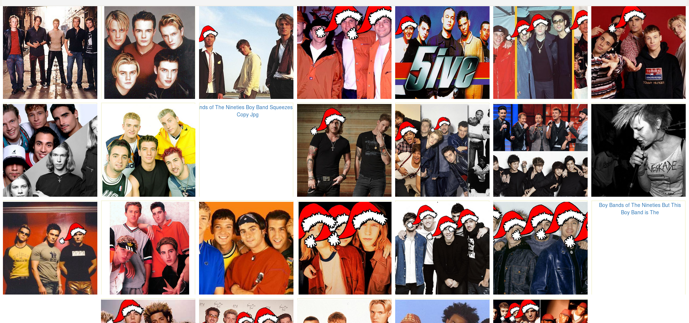

# Proxhyss

Happy hatty image paster




## Hat dimensions
Center of forehead is aligned to center of image.
Edges of head are aligned to (1/3)width and (2/3)width.


# Run as a HTTP proxy

```
$ go get ./...
$ go run cmd/proxy/proxy.go

Set browser's SOCKS proxy to localhost:8080
```

# GIF processing
Downloads gifs from giphy and finds one that can be hatted. Adds hats to each individual frame and dumps them as PNG to a specified directory

```
$ go run cmd/pepparkak/pepparkak.go -tag yesplease -show -dir /tmp/xmas
$ ls /tmp/xmas
frame_001.png   frame002.png   frame003.png ...
```

For external convenience, check out `scripts/giffle.sh`

Additionally with `-export_gif`, the hatted gif is re-combined as `hat.gif` in the same directory

With `-color_match`, the hat is forced to follow the palette of the original GIF, giving a sort of color scheme matching effect. For example, a grayscale GIF will get a gray hat.
